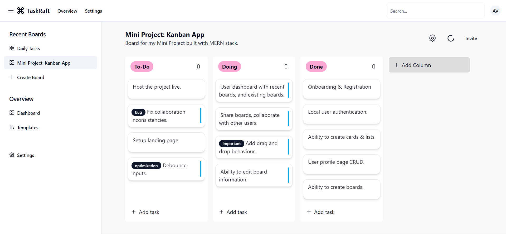

# TaskRaft

    <br/>
   

**TaskRaft** is a compact mini-SaaS designed for collaborative task management using the efficient Kanban system. Built using the MERN Stack, along with [Vite](https://vitejs.dev/), [TypeScript](https://www.typescriptlang.org/), and [shadcn/ui](https://ui.shadcn.com/) + [TailwindCSS](https://tailwindcss.com/) at the frontend. TaskRaft draws inspiration from task management apps like [Tasksboard](https://ui.shadcn.com/) and [Trello](https://trello.com/), offering a simplified yet robust approach. [Tanstack Query](https://example.com/tanstack-query) and [Zustand](https://example.com/zustand) are used for server-side and global state management respectively. User authentication is handled through JSON Web Tokens (JWT), while data modeling relies on [Mongoose](https://mongoosejs.com/).



## Features

- Robust user registration and login powered by JWT authentication.
    - User-friendly profile page for editing personal information.
- An accessible user dashboard for convenient access to recent and existing boards, with the option to create new ones.
- An intuitive board view, reminiscent of popular Kanban board interfaces such as Trello and Tasksboard.
    - Functionality for adding lists to boards and cards to lists.
    - Board information editing capabilities.
- User invitations to facilitate collaborative board access.
    - Real-time collaboration functionality via efficient long-polling mechanisms.

## Dependencies

**Backend:**
- [express](https://expressjs.com/): Fast and minimalist web application framework for Node.js.
- [express-async-handler](https://www.npmjs.com/package/express-async-handler): Simple middleware for handling exceptions inside of async express routes and passing them to your express error handlers.
- [mongoose](https://mongoosejs.com/): Object Data Modeling MongoDB and Node.js.
- [ejs](https://ejs.co/): Templating language.
- [nanoid](https://www.npmjs.com/package/nanoid): Small, secure, and URL-friendly unique ID generator.
- [jsonwebtoken](https://www.npmjs.com/package/jsonwebtoken): JSON Web Token (JWT) implementation for Node.js.
- [bcryptjs](https://www.npmjs.com/package/bcryptjs): Library for hashing and comparing passwords.
- [nodemailer](https://www.npmjs.com/package/nodemailer): Send e-mails with Node.js.

**Frontend:**
- [vite](https://www.npmjs.com/package/vite): A build tool that aims to provide a faster and more efficient development experience for web projects.
    - [eslint](https://www.npmjs.com/package/eslint): A pluggable and configurable linter tool for identifying and fixing problems in JavaScript code.
    - [postcss](https://www.npmjs.com/package/postcss): A tool for transforming CSS with JavaScript plugins.
    - [typescript](https://www.typescriptlang.org/): A typed superset of JavaScript that compiles to plain JavaScript.
- [tailwindcss](https://www.npmjs.com/package/tailwindcss): A highly customizable, low-level CSS framework.
- [react](https://reactjs.org/): A JavaScript library for building user interfaces.
    - [react-router-dom](https://www.npmjs.com/package/react-router-dom): Declarative routing for React applications.
    - [zustand](https://www.npmjs.com/package/zustand): A small, fast, and scaleable state management for React.
    - [react-icons](https://www.npmjs.com/package/react-icons): A set of high-quality SVG icons for React projects.
    - [@tanstack/react-query](https://www.npmjs.com/package/@tanstack/react-query): A powerful data-fetching and state management library for React.
    - [react-hook-form](https://www.npmjs.com/package/react-hook-form): Performant, flexible, and extensible forms with easy-to-use validation.
    - [@dnd-kit/core](https://www.npmjs.com/package/@dnd-kit/core): A set of utility primitives for building performant, accessible, and reliable drag-and-drop interfaces.
- [zod](https://www.npmjs.com/package/zod): A TypeScript-first schema declaration and validation library.
- [date-fns](https://www.npmjs.com/package/date-fns): Modern JavaScript date utility library.
- [nanoid](https://www.npmjs.com/package/nanoid): Small, secure, and URL-friendly unique ID generator.

## 🚀 Getting Started

### Installation

1. Clone the repository.

```sh
git clone https://github.com/waterrmalann/task-raft.git
```

2. Install the dependencies. (frontend and backend are decoupled)

```sh
# server-side dependencies
pnpm install

# client-side dependencies
pnpm -C frontend install
```

3. Rename `.exmaple-env` to `.env` and configure the variables accordingly.

4. Run the project. (from root)

```sh
pnpm run dev
```

5. Access the application.

```
Open your browser and visit http://localhost:3000
```

## 🤝 Contribution

Contributions are always accepted. Feel free to open a pull request to fix any issues or to make improvements you think that should be made. Any contribution will be accepted as long as it doesn't stray too much from the objective of the app. If you're in doubt about whether the PR would be accepted or not, you can always open an issue to get my opinion on it.

## License

This project is licensed under the permissive **MIT License**, see [LICENSE](LICENSE).